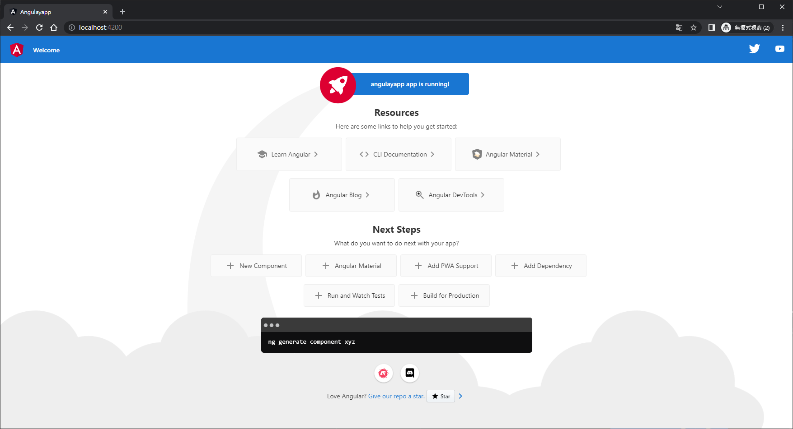

# Angular_Note


# Typescript

```bash
npm i -g typescript
```


```bash
tsc 檔案名.js
```

# M1 Mac 搭建環境筆記

https://brew.sh/index_zh-tw

https://segmentfault.com/a/1190000039005726

https://www.jianshu.com/p/f6c3ecfdbd97

https://www.1024sou.com/article/334250.html

# Angular

https://angular.io/

https://angular.tw/

https://angular.tw/cli


## 安裝angular-cli

```bash
npm install -g @angular/cli
```

##　創建項目

```bash
ng new my-first-project
ng new angulayapp
or
ng new angulayapp --skip-install
```


## 運行項目

```bash
cd angulayapp
npm i
npm start
```



## 新增組件

```bash
ng g component component/news
```

# 數據雙向綁定

```js
import { FormsModule } from '@angular/forms';
```

```html
<div>
  <label for="">用戶名</label>
  <input type="text" [(ngModel)]="username">
  <h1>{{username}}</h1>

  <label for="">密碼</label>
  <input type="text" [(ngModel)]="password">
  <h1>{{password}}</h1>
  <button (click)="clickFn()">提交</button>
</div>
```

# 自定義管道

```bash
ng g pipe filter/ivesUppercase
```

# 生命週期

```js
  ngOnChanges() {
    console.log("@@@ngOnChanges")
  }

  ngOnInit() {
    console.log("@@@ngOnInit")
  }

  ngDoCheck() {
    console.log("@@@ngDoCheck")
  }

  ngAfterContentInit() {
    console.log("@@@ngAfterContentInit")
  }

  ngAfterContentChecked() {
    console.log("@@@ngAfterContentChecked")
  }

  ngAfterViewInit() {
    console.log("@@@ngAfterViewInit")
  }

  ngAfterViewChecked() {
    console.log("@@@ngAfterViewChecked")
  }

  ngOnDestory() {
    console.log("@@@ngOnDestory")
  }
```

# 創建自訂義指令

```bash
ng g directive directive/ivesstyle
```

# 創建服務

```bash
ng g service service/ivesapp
```